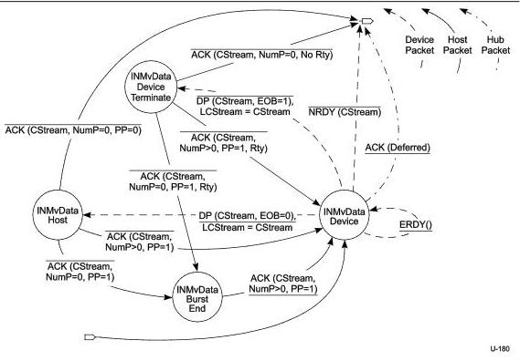

Protocol Layer

### 8.12.1.4.4.5 Move Data

In the Host IN Move Data state, CStream is set to the same value at both ends of the pipe and the pipe may actively move data. The details of the bus transactions executed in the Move Data state and its exit conditions are defined in the Host IN Move Data State Machine defined below.

Figure 8-44. Host IN Move Data State Machine (HIMDSM)

The Host IN Move Data State Machine (HIMDSM) is entered from the Start Stream or Idle states as described above. The entry into the HIMDSM immediately transitions to the INMvData Device state. The HIMDSM allows either the device to terminate the Move Data operation because it has exhausted its Function Data associated with a Stream or the host to terminate the Move Data operation because it has exhausted its Endpoint Buffer space associated with a Stream.

The HIMDSM always exits to the Idle state. The Retry (Rty=1) flag shall never be set in a packet that causes a HIMDSM exit. A Stream pipe remains in the Move Data state during packet retries.

Note: The Stream ID value shall be CStream for all packets exchanged in the Move Data state, except the INMvData Device substate ERDY transition. For the identified substates, if a Stream ID value other than CStream is detected while in the HIMDSM the host should halt the endpoint.

8-85