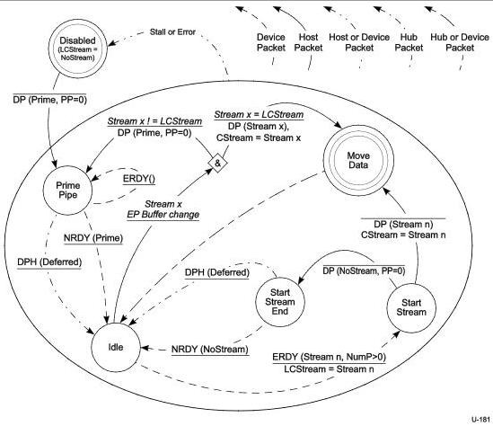

Universal Serial Bus 3.1 Specification, Revision 1.0

### 8.12.1.4.5 Host OUT Stream Protocol

This section defines the Enhanced SuperSpeed packet exchanges that transition the host side of the Stream Protocol from one state to another on an OUT bulk endpoint.

In the following text, a Host OUT Stream state transition is assumed to occur at the point the host sends the first bit of the first symbol of a state machine related message to the device, or at the point the host first decodes state machine related message from the device.

For an OUT pipe, Function Buffers in the device receive Endpoint Data from the host.

Figure 8-45. Host OUT Stream Protocol State Machine (HOSPSM)

#### 8.12.1.4.5.1 Disabled

After an endpoint is configured or receives a SetFeature(ENDPOINT_HALT) request, the pipe is in the Disabled state and LCStream is initialized to NoStream.

DP(Prime, PP=0) - When the initial Endpoint Data is assigned to the pipe by system software, the host shall send a zero-length DP with the Stream ID field set to Prime to the device, and transition the pipe to the Prime Pipe state. The DPP shall contain a zero-length data payload.

8-88