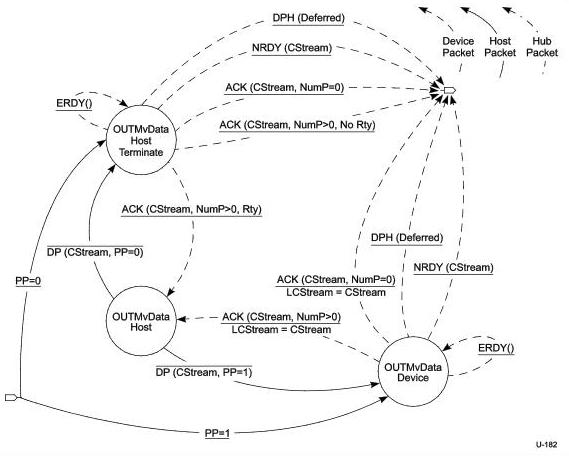

Protocol Layer

for a host response to the Start Stream request. Note that this transition can occur only if the tERDYTimeout has been exceeded. There is no DPP associated with a deferred DPH.

### 8.12.1.4.5.6 Move Data

In the Host OUT Move Data state, CStream is set to the same value at both ends of the pipe and the pipe may actively move data. The details of the bus transactions executed in the Move Data state and its exit conditions are defined in the Host OUT Move Data State Machine defined below.

Figure 8-46. Host OUT Move Data State Machine (HOMDSM)

The Host OUT Move Data State Machine (HOMDSM) is entered from the Start Stream or Idle states as described above. The entry into the HOMDSM immediately transitions to the OUTMvData Device state. The HOMDSM allows either the device to terminate the Move Data operation because it has exhausted its Function Buffer space associated with a Stream or the host to terminate the Move Data operation because it has exhausted its Endpoint Data associated with a Stream.

PP = 0 - Upon entry into the HOMDSM, if the host has only one packet of Endpoint Data available for the Stream then PP will equal 0 in the first DP sent to the Device, and it shall transition to the OUTMvData Device Terminate state.

8-91