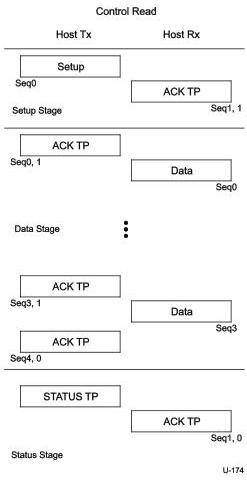

Protocol Layer

Figure 8-47 and Figure 8-48 show the transaction order, the data sequence number value, and the data packet types for control read and write sequences.

Figure 8-47. Control Read Sequence

8-95