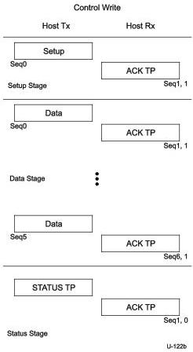

Universal Serial Bus 3.1 Specification, Revision 1.0

Figure 8-48. Control Write Sequence

When a STALL TP is sent by a control endpoint in either the Data or Status stages of a control transfer, a STALL TP shall be returned on all succeeding accesses to that endpoint until a SETUP DP is received. An endpoint shall return an ACK TP when it receives a subsequent SETUP DP. For control endpoints, if an ACK TP is returned for the SETUP transaction, the host expects that the endpoint has automatically recovered from the condition that caused the STALL and the endpoint shall operate normally.

### 8.12.2.1 Reporting Status Results

During the Status stage, a device reports to the host the outcome of the previous Setup and Data stages of the transfer. Three possible results may be returned:

- The command sequence completed successfully.
- The command sequence failed to complete.
- The device is still busy completing the command.

Status reporting is always in the device-to-host direction. Table 8-31 summarizes the type of responses required for each. All Control transfers return status in the TP that is returned to the host in response to a STATUS TP transaction.

8-96