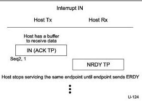
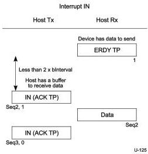
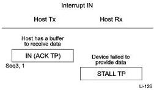

Universal Serial Bus 3.1 Specification, Revision 1.0

Figure 8-50. Host Stops Servicing Interrupt IN Transaction Once NRDY is Received

Figure 8-51. Host Resumes IN Transaction after Device Sent ERDY

Figure 8-52. Endpoint Sends STALL TP

8-100