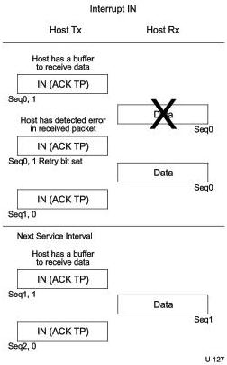

Protocol Layer

Figure 8-53. Host Detects Error in Data and Device Resends Data

Note: In Figure 8-53 the host retries the data packet received with an error in the same service interval. It is not required to do so and may retry the transaction in the next service interval.

### 8.12.4.2 Interrupt OUT Transactions

When the host wants to start an Interrupt OUT transaction to an endpoint, it sends the first DP with the expected sequence number. The host may send more packets to the endpoint in the same service interval if the endpoint supports a burst size greater than one. If an endpoint was able to receive that data from the host, it sends an ACK TP to acknowledge the successful receipt of data.

Note that the host always initializes the first DP sequence number to zero in the first transfer it performs to an endpoint after the endpoint is initialized (via a Set Configuration or Set Interface or ClearFeature (ENDPOINT_HALT) command – refer to Chapter 9 for details on these commands).

As long as a device returns ACK TPs in response to the host sending data packets and the transfer is not complete, the host shall continue to send data to the device during every service interval for that endpoint. A device shall acknowledge the successful reception of the DP or ask the host to retry the transaction if the data packet was corrupted.

In response to the OUT data sent by the host an interrupt endpoint shall respond as described in Section 8.11.3.

8-101