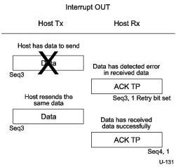
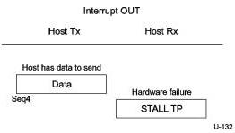

Universal Serial Bus 3.1 Specification, Revision 1.0

Figure 8-57. Device Detects Error in Data and Host Resends Data

Note: In Figure 8-57 the host retries the data packet received with an error in the same service interval. It is not required to do so and may retry the transaction in the next service interval.

Figure 8-58. Endpoint Sends STALL TP

### 8.12.5 Host Timing Information

USB 3.0 host controllers do not broadcast regular start of frame (SOF) packets to all devices on a Enhanced SuperSpeed USB link. Host timing information is sent by the host via isochronous timestamp packets (ITP) when the root port link is in U0 around a bus interval boundary. Hubs forward isochronous timestamp packets (with any necessary modifications as described in Section 10.9.4.4) to any downstream port with a link in U0 and which has completed Port Configuration. The host shall provide isochronous timestamps based on a non-spread clock. Devices are responsible for keeping the link in U0 around bus interval boundaries when isochronous timestamps are required for device operation. A device should never keep the link in U0 for the sole purpose of receiving timestamps unless the timestamps are required for device operation.

Note: A device will receive an isochronous timestamp if its link is in U0 around a bus interval boundary. This means that devices without any isochronous endpoints or need for synchronization may discard isochronous timestamp packets without negative side effects.

8-104