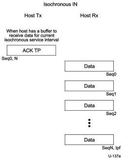
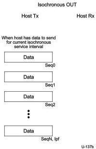

Protocol Layer

Figure 8-60. Enhanced SuperSpeed Isochronous IN Transaction Format

Figure 8-61. Enhanced SuperSpeed Isochronous OUT Transaction Format

The first DP or ACK TP in each service interval shall start with the sequence number set to 0.

8-107