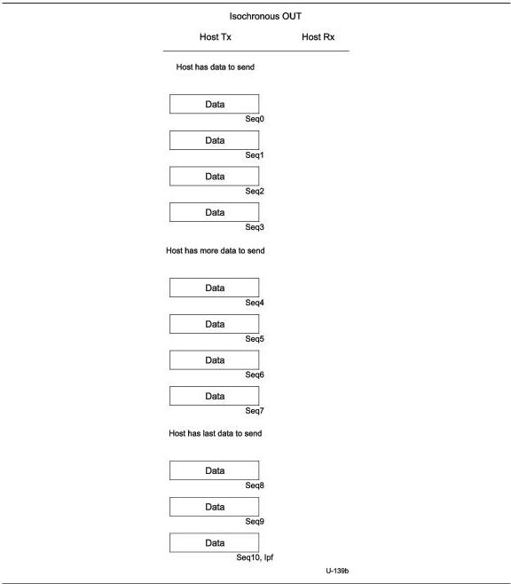

Universal Serial Bus 3.1 Specification, Revision 1.0

Figure 8-65. Sample Enhanced SuperSpeed Isochronous OUT Transaction

### 8.12.6.1.1 Smart Isochronous Scheduling Protocol

Figure 8-66 and Figure 8-67 show sample isochronous IN and OUT transactions with smart Isochronous scheduling to endpoints that have service intervals of 8. In the isochronous IN example below the host is only sending one ACK TP with the SSI and DBI field set to non-zero values when asking for data from the endpoint. It should be noted that a host may send multiple

8-112