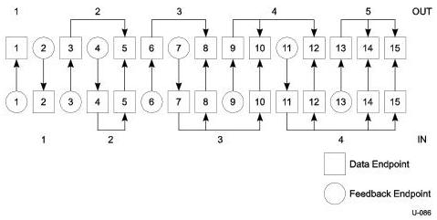

Universal Serial Bus 3.1 Specification, Revision 1.0

The endpoint numbers can be intertwined as illustrated in Figure 9-8.

Figure 9-8. Example of Feedback Endpoint Relationships

For high-speed bulk and control OUT endpoints, the bInterval field is only used for compliance purposes; the host controller is not required to change its behavior based on the value in this field.

9-54