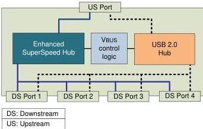

Universal Serial Bus 3.1 Specification, Revision 1.0

**Figure 10-1. USB Hub Architecture**

When a USB hub connects on its upstream facing port at Gen 1 speed, it shall operate (and be referred to) as a SuperSpeed hub (including operating its downstream ports at no higher than Gen 1 speed).

When a USB hub connects on its upstream facing port at a speed above Gen 1 speed, it shall operate (and be referred to) as a SuperSpeedPlus hub.

When the hub upstream facing port is attached to an electrical environment that is only operating at high-speed or full-speed, then Enhanced SuperSpeed connectivity is not available to devices attached to downstream facing ports.

Figure 10-1 shows a high level block diagram of a four port USB hub and the locations of its upstream and downstream facing ports. A USB hub is the logical combination of two hubs: a USB 2.0 hub and an Enhanced SuperSpeed hub. Each hub operates independently on a separate data bus. Typically, the only signal shared logic between them is to control VBUS. If either the USB 2.0 hub or Enhanced SuperSpeed hub controllers requires a downstream port to be powered, power is turned on for the port. A USB hub connects on both interfaces upstream whenever possible. All exposed downstream ports on a USB hub shall support both Enhanced SuperSpeed and USB 2.0 connections. Host controller ports may have different requirements.

10-2