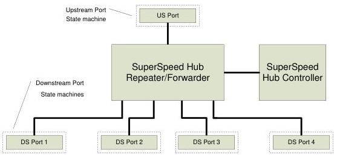

Hub, Host Downstream Port, and Device Upstream Port Specification

Figure 10-2 shows the SuperSpeed portion of a USB hub consisting of a Hub Repeater/Forwarder section and a Hub Controller section.

The USB 2.0 portion of a USB hub shall meet all requirements of the USB 2.0 Specification unless specific exceptions are noted.

The SuperSpeed Hub Repeater/Forwarder is responsible for connectivity setup and tear-down. It also supports exception handling, such as bus fault detection and recovery and connect/disconnect detect. The SuperSpeed Hub Controller provides the mechanism for host-to-hub communication. Hub-specific status and control commands permit the host to configure a hub and to monitor and control its individual downstream facing ports.

Figure 10-2. SuperSpeed Portion of the USB Hub Architecture

10-3