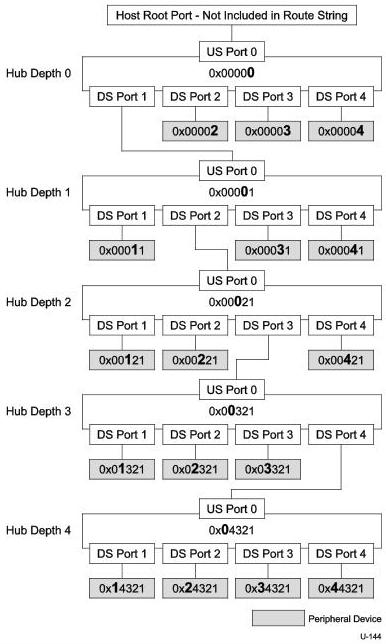

Hub, Host Downstream Port, and Device Upstream Port Specification

Figure 10-5 illustrates the use of route strings in an example topology with five levels of four port USB hubs. The hub depth value for each level of hub is illustrated in the figure. Each hub and each device in the topology contains the route string that would be used to route a packet to that device/hub. For each hub depth, the octet in the route string that determines the routing target at that hub depth is shown in bold and a larger font size than the rest of the route string. The host root port is not included in the 20-bit route string.

Figure 10-5 Route String Example

10-7