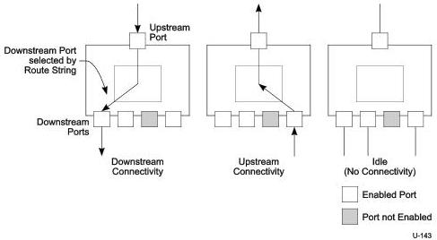

Universal Serial Bus 3.1 Specification, Revision 1.0

### 10.1.3.2 SuperSpeed Hub Packet Signaling Connectivity

The SuperSpeed hub repeater/forwarder contains buffering for header and data packets. A SuperSpeed hub repeater/forwarder does not use the repeater-only model used for high-speed connectivity in a USB 2.0 hub. This change allows multiple downstream devices to send asynchronous messages simultaneously without data loss and for some traffic to be stored and delivered when it is directed to downstream ports when the links are not in U0.

Figure 10-6 shows the high level packet signaling connectivity behavior for SuperSpeed hubs in the upstream and downstream directions. Later sections describe the SuperSpeed hub internal buffering and connectivity in more detail. A SuperSpeed hub also has an Idle state, during which the SuperSpeed hub makes no connectivity. When in the Idle state, all of the SuperSpeed hub's ports (upstream plus downstream) are U1, U2 or in U0 receiving and transmitting logical idles waiting for the start of the next packet.

Figure 10-6. SuperSpeed Hub Signaling Connectivity

If a downstream facing port is enabled (i.e., in a state where it can propagate signaling through the hub) and the SuperSpeed hub detects the start of a packet on that port, the SuperSpeed hub begins to store the packet header. The SuperSpeed hub transmits the valid header packet received on the downstream port upstream, but not to any other downstream facing ports. This means that when a device operating at Gen 1 speed or a SuperSpeed hub transmits a packet upstream, only those SuperSpeed hubs in a direct line between the transmitting device and the host will see the packet.

All packets except Isochronous Timestamp Packets (ITP) are unicast in the downstream direction; SuperSpeed hubs operate using a direct connectivity model. This means that when the host or SuperSpeed hub transmits a packet downstream, only those SuperSpeed hubs in a direct line between the host and recipient device will see the packet.

10-8