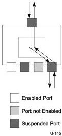

Universal Serial Bus 3.1 Specification, Revision 1.0

### 10.1.4 Resume Connectivity

Hubs exhibit different connectivity behaviors for upstream- and downstream-directed resume signaling. A hub does not propagate resume signaling from its upstream facing port to any of its downstream facing ports unless a downstream facing port is suspended and has received resume signaling since it was suspended. Figure 10-7 illustrates hub upstream and downstream resume connectivity.

Figure 10-7. Resume Connectivity

If a hub upstream port is suspended and the hub detects resume signaling from a suspended downstream facing port, the hub propagates that signaling upstream and does not reflect that signaling to any of the downstream facing ports (including the downstream port that originated resume signaling). If a hub upstream port is not suspended and the hub detects resume signaling from a suspended downstream facing port, the hub reflects resume signaling to the downstream port. Note that software shall not initiate a transition to U3 on the upstream port of a hub unless it has already initiated transitions to U3 on all enabled downstream ports. A detailed discussion of resume connectivity appears in Section 10.10.

### 10.1.5 Hub Fault Recovery Mechanisms

Hubs are the essential USB component for establishing connectivity between the host and other devices. It is vital that any connectivity faults be prevented if possible and detected in the unlikely event they occur.

Hubs must also be able to detect and recover from lost or corrupted packets that are addressed to the Hub Controller. Because the Hub Controller is, in fact, another USB device, it shall adhere to the same rules as other USB devices, as described in Chapter 8.

10-10