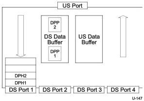

Universal Serial Bus 3.1 Specification, Revision 1.0

### 10.1.6.1.2 Hub Data Buffer Architecture

Figure 10-9. SuperSpeed Hub Data Buffer Traffic (Header Packet Buffer Only Shown for DS Port 1)

Figure 10-9 shows the logical representation of the data buffer architecture in a typical SuperSpeed hub. SuperSpeed hubs provide independent buffering for data packet payloads (DPP) in both the upstream and downstream directions. The Enhanced SuperSpeed Architecture allows concurrent transactions to occur in both the upstream and downstream directions. In the figure, two data packets are in progress in the downstream direction. The SuperSpeed hub can store more than one data packet payload at the same time. In rare occurrences where data packet payloads are discarded because buffering is unavailable, the end-to-end protocol will recover by retrying the transaction. The isochronous protocol does not include retries. However, discard errors are expected less frequently then bit errors on the physical bus.

Note: Data packet headers are stored and handled in the same fashion as other header packet packets using the header packet buffers. DPPs are handled using the separate data buffers.

### 10.1.6.2 SuperSpeedPlus Hub Buffer Architecture

The SuperSpeedPlus hub has significantly more data packet header (DPH) and data packet payload (DPP) buffering than a SuperSpeed hub. Downstream ports can operate at a different speed than the upstream port and there can be multiple DPs simultaneously in transit on different downstream ports-. Therefore, DPs may have to be buffered until they can be transmitted out of the hub. Since there can be multiple DPs buffered in a hub awaiting transmission on a port, the SuperSpeedPlus hub also has local arbitration rules to select the packet to be transmitted next on a port. There are specific buffering requirements for upstream and downstream traffic. See Section 10.8 for more details.

10-12