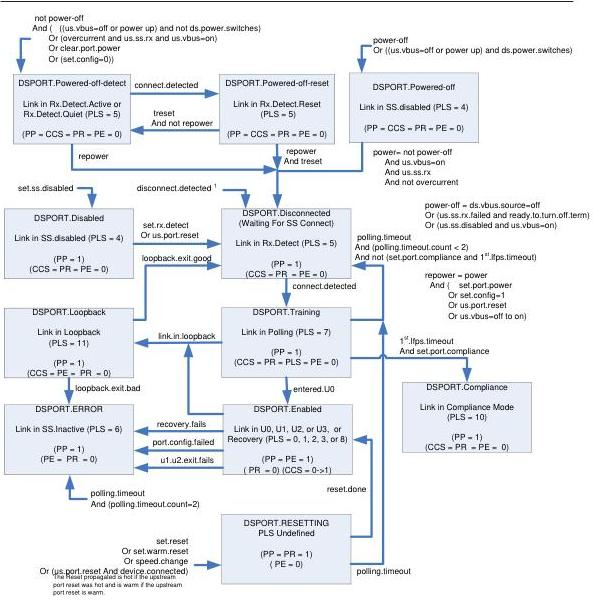

Hub, Host Downstream Port, and Device Upstream Port Specification

Port Status Field:

Notation Field Name

PP PORT_POWER

CCS PORT_CONNECTION

PR PORT_RESET

PLS PORT_LINK_STATE

PE PORT_ENABLE

Note:

Clear Port Feature (PORT_ENABLED) and Set Port Feature (PORT_ENABLED) are not used for SS Ports

1 This direct transition may only occur from a DSPORT state whose link is in the SS.Inactive, Rx.Detect.Active (during DSPORT.RESETTING), U1, U2, or U3 state.

Figure 10-10. Downstream Facing Hub Port State Machine

10-15