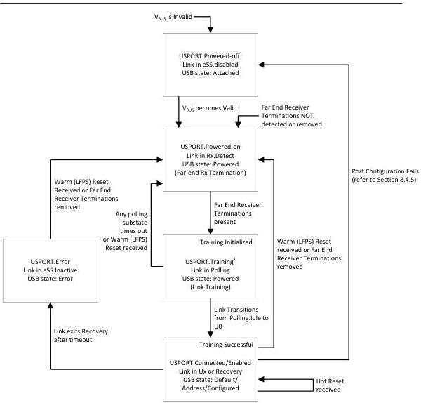

Universal Serial Bus 3.1 Specification, Revision 1.0

¹ If Port Configuration fails, the port shall transition to the USPORT.Powered-off state with the link in eSS.Disabled state and USB Device in the Attached state. V_BUS may still be present on the upstream port. V_BUS must be toggled to transition to the USPORT.Powered state.

U-150A

Figure 10-12. Upstream Facing Hub Port State Machine

### 10.5.1 Upstream Facing Port State Descriptions

Refer to Figure 9-1 for hub USB states.

#### 10.5.1.1 USPORT.Powered-off

The USPORT.Powered-off state is the default state for an upstream facing port.

A port shall transition into this state if any of the following situations occur:

10-28