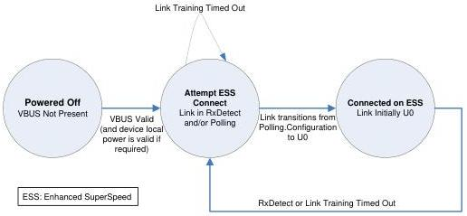

Universal Serial Bus 3.1 Specification, Revision 1.0

- From the USPORT.Connected/Enabled state if the link enters Recovery and times out without recovering.

In this state, the port's link shall be in the eSS.Inactive state. The corresponding hub USB state shall be Error.

A port exits the Error state only if a Warm Reset is received on the link or if Far-end Receiver Terminations are removed.

### 10.5.2 Hub Connect State Machine

The following sections provide a functional description of a state machine that exhibits correct hub behavior for when to connect on the Enhanced SuperSpeed bus or the USB 2.0 bus. For a hub, the connection logic for the Enhanced SuperSpeed bus and the USB 2.0 bus are completely independent. The hub shall follow the USB 2.0 specification for connecting on USB 2.0. Figure 10-13 is an illustration of the hub connect state machine for an Enhanced SuperSpeed hub. Each of the states is described in Section 10.5.2.1.

Figure 10-13. Hub Connect (HCONNECT) State Machine

### 10.5.2.1 Hub Connect State Descriptions

### 10.5.2.2 HCONNECT.Powered-off

The HCONNECT.Powered-off state is the default state for a hub device. A hub device shall transition into this state if the following situation occurs:

- From any state when VBUS is removed.

In this state, the hub upstream port's link shall be in the eSS.Disabled state.

10-30