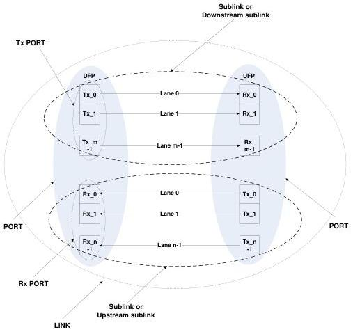

Terms and Abbreviations

[tbl-31.md](tbl-31.md)

Figure 2-1. Port and Link Pictorial

Figure 2-1 illustrates the parts of a port and the connection between ports. The USB 3.1 specification only defines a port with a single Tx and Rx. The inclusion of more than one Rx/Tx

For USB Contributor Review Only

2-9