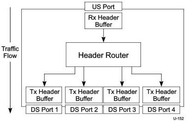
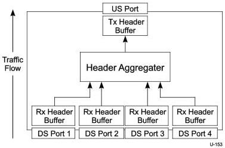

Hub, Host Downstream Port, and Device Upstream Port Specification

packet Tx buffer for the upstream port. The buffers shown in Figure 10-15 and Figure 10-16 are independent physical buffers.

Figure 10-15. Example SS Hub Header Packet Buffer Architecture - Downstream Traffic

Figure 10-16. Example SS Hub Header Packet Buffer Architecture - Upstream Traffic

The following lists functional requirements for a SuperSpeed hub buffer architecture with the assumption in each case that only the indicated port on the hub is receiving or transmitting header packets:

- A SuperSpeed hub starting with all header packet buffers empty shall be able to receive at least eight header packets directed to the same downstream port that is not in U0 before its upstream port runs out of header packet flow control credits.

10-37