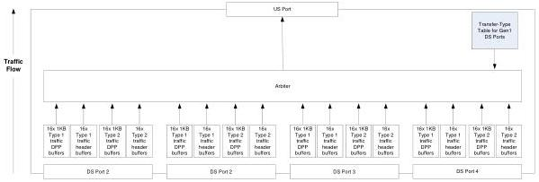

Hub, Host Downstream Port, and Device Upstream Port Specification

### 10.8.2 SKP Ordered Sets

A SuperSpeedPlus hub transmits SKP ordered sets, following the rules for all transmitters in Chapter 6, for all transmissions.

### 10.8.3 Interpacket Spacing

When a hub originates or forwards packets, DPHs and their corresponding DPPs shall be sent as required in Section 7.2.1.

The SuperSpeedPlus hub has several aspects to its store and forward behavior including buffering, arbitration among packets to be forwarded upstream, and modifications of packets during forwarding.

### 10.8.4 Upstream Flowing Buffering

The SuperSpeedPlus hub shall provide buffering for 16x 1KB Control/Bulk DPP buffers and 16x 1KB Interrupt/Isochronous DPP buffers for each DFP receiver. The SuperSpeedPlus hub shall provide buffering for 16x Control/Bulk header buffers and 16x TP/Interrupt/Isochronous header buffers per DFP receiver. These buffers shall be used to hold packets received from downstream ports that are awaiting transmission on the upstream port.

Buffer space is required for each downstream port since there can be packets simultaneously arriving on each downstream port while there is a packet being transmitted on the upstream port. Further, the hub arbitration rules (see Section 10.8.6) can delay when a packet received on a downstream port can be transmitted on the upstream port.

Figure 10-17. Logical Representation of Upstream Flowing Buffers

### 10.8.5 Downstream Flowing Buffering

The SuperSpeedPlus hub shall provide buffering for 18x 1KB Control/Bulk DPP buffers and 18x 1KB Interrupt/Isochronous DPP buffers per hub. The SuperSpeedPlus hub shall provide buffering for 18x Control/Bulk header buffers and 18x TP/Interrupt/Isochronous header buffers per hub.

Buffering for downstream flowing traffic is primarily present to provide a rate matching function due to the different possible upstream port and downstream port speeds. Therefore, it is provided

10-39