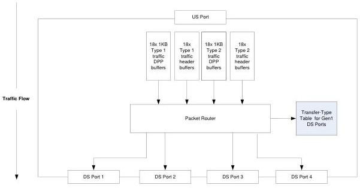

Universal Serial Bus 3.1 Specification, Revision 1.0

for each hub and not for each downstream port. However, the organization and function of this buffering shall allow packets to be received from the upstream port and then subsequently transmitted on multiple downstream ports simultaneously and in a different order than the order in which they were received. That is, this buffering cannot be organized as a single, simple FIFO.

Figure 10-18. Logical Representation of Downstream Flowing Buffers

### 10.8.6 SuperSpeedPlus Hub Arbitration of Packets

#### 10.8.6.1 Arbitration Weight

The iᵗʰ downstream facing port (DFPi) has an arbitration weight (AW) associated with it. This weight shall be set to;

DFPi.AW = DFPi.link_speed / ArbitrationWeightBase

For example, a port link operating at 5Gb/s will have an AW of 4. A port link operating at 10Gb/s will have an AW of 8.

#### 10.8.6.2 Direction Independent Packet Selection

When there are multiple packets buffered that are ready to be transmitted out of the hub, the SuperSpeedPlus hub has to select which packet to transmit next.

There are several selection rules that are independent of direction of packet flow.

The SuperSpeedPlus hub has additional rules that are specific for upstream and downstream flowing packet reception and selection (see the next two sections).

A TP shall only be considered as a possible candidate after it has been fully received and validated.

10-40