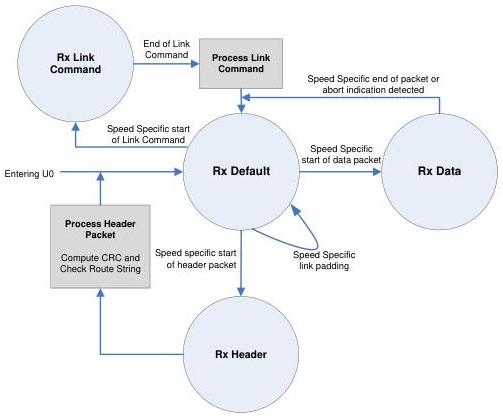

Hub, Host Downstream Port, and Device Upstream Port Specification

### 10.9.3 Port Receive State Machine

This section describes the functional requirements of the upstream and downstream facing port receiver (Rx) state machine.

Figure 10-20. Upstream Facing Port Rx State Machine

### 10.9.4 Port Receive State Descriptions

#### 10.9.4.1 Rx Default

In the Rx Default state, the port receiver is actively receiving symbols and looking for the speed specific beginning of a valid packet or a link command.

A port receiver shall transition to the Rx Default state in any of the following situations:

- From the Rx Data state when a speed specific end of packet or abort indication is detected.
- From the Rx Header state when the last symbol of the header packet is received.
- After receiving a link command.

10-47