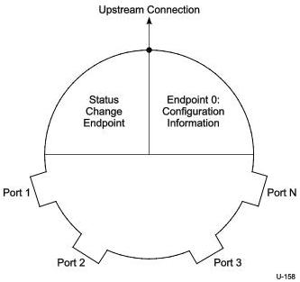

Hub, Host Downstream Port, and Device Upstream Port Specification

Figure 10-21. Example Hub Controller Organization

### 10.13.1 Endpoint Organization

The Hub Class defines one additional endpoint beyond the default control pipe, which is required for all hubs: the Status Change endpoint. This endpoint has the maximum burst size set to one. The host system receives port and hub status change notifications through the Status Change endpoint. The Status Change endpoint is an interrupt endpoint. If no hub or port status change bits are set, then the hub returns an NRDY when the Status Change endpoint receives an IN (via an ACK TP) request. When a status change bit is set, the hub will send an ERDY TP to the host. The host will subsequently ask the Status Change endpoint for the data, which will indicate the entity (hub or port) with a change bit set. The USB system software can use this data to determine which status registers to access in order to determine the exact cause of the status change interrupt.

### 10.13.2 Hub Information Architecture and Operation

Figure 10-22 shows how status, status change, and control information relate to device states. Hub descriptors and Hub/Port Status and Control are accessible through the default control pipe. The Hub descriptors may be read at any time. When a hub detects a change on a port or when the hub changes its own state, the Status Change endpoint transfers data to the host in the form specified in Section 10.13.4.

Hub or port status change bits can be set because of hardware or software events. When set, these bits remain set until cleared directly by the USB system software through a ClearPortFeature() request or by a hub reset. While a change bit is set, the hub continues to report a status change when the Status Change endpoint is read until all change bits have been cleared by the USB system software.

10-55