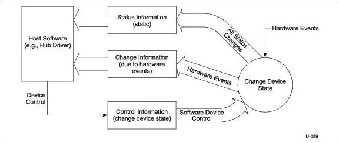

Universal Serial Bus 3.1 Specification, Revision 1.0

Figure 10-22. Relationship of Status, Status Change, and Control Information to Device States

The USB system software uses the interrupt pipe associated with the Status Change endpoint to detect changes in hub and port status.

10-56