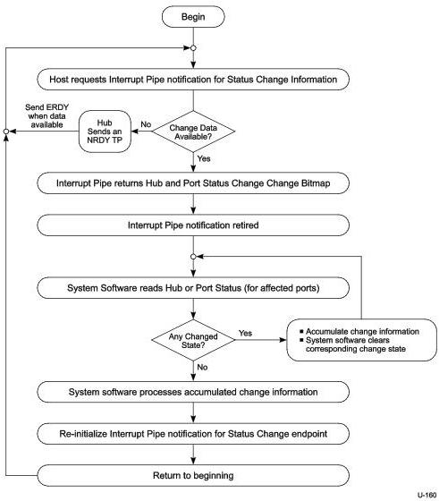

Hub, Host Downstream Port, and Device Upstream Port Specification

### 10.13.3 Port Change Information Processing

Hubs report a port's status through port commands on a per-port basis. The USB system software acknowledges a port change by clearing the change state corresponding to the status change reported by the hub. The acknowledgment clears the change state for that port so future data transfers to the Status Change endpoint do not report the previous event. This allows the process to repeat for further changes (see Figure 10-23).

Figure 10-23. Port Status Handling Method

10-57