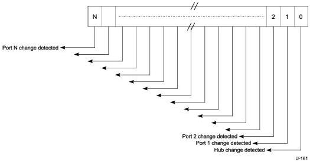

Universal Serial Bus 3.1 Specification, Revision 1.0

### 10.13.4 Hub and Port Status Change Bitmap

The Hub and Port Status Change Bitmap, shown in Figure 10-24, indicates whether the hub or a port has experienced a status change. This bitmap also indicates which port(s) have had a change in status. The hub returns this value on the Status Change endpoint. Hubs report this value in byte-increments. For example, if a hub has six ports, it returns a byte quantity, and reports a zero in the invalid port number field locations. The USB system software is aware of the number of ports on a hub (this is reported in the hub descriptor) and decodes the Hub and Port Status Change Bitmap accordingly. The hub reports any changes in hub status in bit zero of the Hub and Port Status Change Bitmap.

The Hub and Port Status Change Bitmap size is two bytes. Hubs report only as many bits as there are ports on the hub. A USB hub may have no more than nMaxHubPorts.

Figure 10-24. Hub and Port Status Change Bitmap

10-58