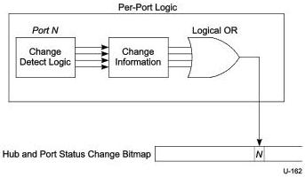

Hub, Host Downstream Port, and Device Upstream Port Specification

Any time any of the Status Changed bits are non-zero, an ERDY is returned (if an NRDY was previously sent) notifying the host that the Hub and Port Status Change Bitmap has changed. Figure 10-25 shows an example creation mechanism for hub and port change bits.

Figure 10-25. Example Hub and Port Change Bit Sampling

### 10.13.5 Over-current Reporting and Recovery

USB devices shall be designed to meet applicable safety standards. Usually, this will mean that a self-powered hub implements current limiting on its downstream facing ports. If an over-current condition occurs, it causes a status and state change in one or more ports. This change is reported to the USB system software so that it can take corrective action.

A hub may be designed to report over-current as either a port or a hub event. The hub descriptor field wHubCharacteristics is used to indicate the reporting capabilities of a particular hub (refer to Section 10.15.2.1). The over-current status bit in the hub or port status field indicates the state of the over-current detection when the status is returned. The over-current status change bit in the Hub or Port Change field indicates if the over-current status has changed.

When a hub experiences an over-current condition, it shall place all affected ports in the DSPORT-Powered-off-reset state. If a hub has per-port power switching and per-port current limiting, an over-current condition on one port may still cause the power on another port to fall below specified minimums. In this case, the affected port is placed in the DSPORT-Powered-off-reset state and C_PORT_OVER_CURRENT is set for the port, but PORT_OVER_CURRENT is not set. If the hub has over-current detection on a hub basis, then an over-current condition on the hub will cause all ports to enter any DSPORT-Powered-off-reset state. However, in this case, neither C_PORT_OVER_CURRENT nor PORT_OVER_CURRENT is set for the affected ports.

Host recovery actions for an over-current event should include the following:

1. Host gets change notification from hub with over-current event.
2. Host extracts appropriate hub or port change information (depending on the information in the change bitmap).
3. Host waits for over-current status bit to be cleared to 0.
4. Host cycles power to on for all of the necessary ports (e.g., issues a SetPortFeature(PORT_POWER) request for each port).
5. Host re-enumerates all affected ports.

10-59