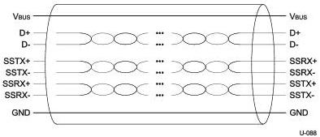

USB 3.1 Architectural Overview

### 3.1.1.1 USB 3.1 Mechanical

The mechanical specifications for USB 3.1 cables and connector assemblies are provided in Chapter 5. All USB devices have an upstream connection. Hosts and hubs (defined below) have one or more downstream connections. Upstream and downstream connectors are not mechanically interchangeable, thus eliminating illegal loopback connections at hubs.

USB 3.1 cables have eight primary conductors: three twisted signal pairs for USB data paths and a power pair. Figure 3-2 illustrates the basic signal arrangement for the USB 3.1 cable. In addition to the twisted signal pair for USB 2.0 data path, two twisted signal pairs are used to provide the Enhanced SuperSpeed data path, one for the transmit path and one for the receive path.

Figure 3-2. USB 3.1 Cable

USB 3.1 receptacles (both upstream and downstream) are backward compatible with USB 2.0 connector plugs. USB 3.1 cables and plugs are not intended to be compatible with USB 2.0 upstream receptacles. As an aid to users, USB 3.1 recommends standard coloring for plastic portions of USB 3.1 plugs and receptacles.

Electrical (insertion loss, return loss, crosstalk, etc.) performance for USB 3.1 is defined with regard to raw cables, mated connectors, and mated cable assemblies, with compliance requirements using industry test specifications established for the latter two categories. Similarly, mechanical (insertion/extraction forces, durability, etc.) and environmental (temperature life, mixed flowing gas, etc.) requirements are defined and compliance established via recognized industry test specifications.

### 3.1.2 USB 3.1 Power

The specification covers two aspects of power:

- Power distribution over the USB deals with the issues of how USB devices consume power provided by the downstream ports to which they are connected. USB 3.1 power distribution is similar to USB 2.0, with increased supply budgets for devices operating on an Enhanced SuperSpeed bus.
- Power management deals with how hosts, devices, hubs, and the USB system software interact to provide power efficient operation of the bus. The power management of the USB 2.0 bus portion is unchanged. The use model for power management of the Enhanced SuperSpeed bus is described in Appendix C.

3-3