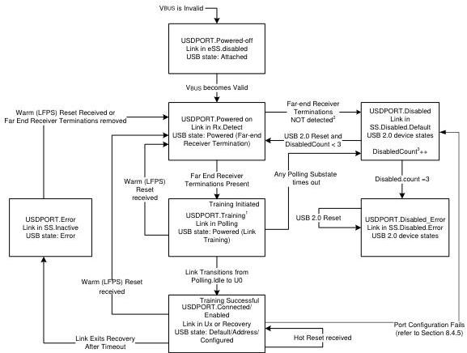

Universal Serial Bus 3.1 Specification, Revision 1.0

¹ Peripheral Device must disconnect on USB2.0 within tUSB2SwitchDisconnect of entering this state.

² If USPORT-Powered on was entered from any state except USPORT.Disabled then this transition shall take place if Far-end Receiver Terminations (RRX-DC) are not detected after 8 successive Rx.Detect.Quiet to Rx.Detect.Active transitions. If USPORT-Powered on was entered from the USPORT.Disabled state, then this transition shall take place the first time that Far-end Receiver Terminations are not detected in the Rx.Detect.Active substate.

³ Disabled count is incremented each time the "Disabled" state is entered from the "Training Initiated" state. Disabled count is reset to '0' each time the link completes Port Configuration.

Figure 10-26. Peripheral Upstream Device Port State Machine

### 10.18.2.1 USDPORT-Powered-off

The USDPORT-Powered-off state is the default state for a peripheral device. A peripheral device shall transition into this state if any of the following situations occur:

- From any state when VBUS is invalid.

In this state, the port's link shall be in the eSS.Disabled state and the USB 2.0 pull-up is not applied. The corresponding peripheral USB state shall be Attached.

10-90