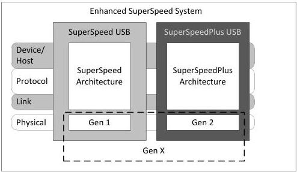

USB 3.1 Architectural Overview

U-3-002

Figure 3-3. USB 3.1 Terminology Reference Model

The Enhanced SuperSpeed bus is a layered communications architecture that is comprised of the following elements:

- Enhanced SuperSpeed Interconnect. The Enhanced SuperSpeed interconnect is the manner in which devices are connected to and communicate with the host over the Enhanced SuperSpeed bus. This includes the topology of devices connected to the bus, the communications layers, the relationships between them and how they interact to accomplish information exchanges between the host and devices.
- Devices. Enhanced SuperSpeed devices are sources or sinks of information exchanges. They implement the required device-end, Enhanced SuperSpeed communications layers to accomplish information exchanges between a driver on the host and one or more logical functions on the device.
- Host. An Enhanced SuperSpeed host is a source or sink of information. It implements the required host-end, Enhanced SuperSpeed communications layers to accomplish information exchanges over the bus. It owns the Enhanced SuperSpeed data activity schedule and management of the Enhanced SuperSpeed bus and all devices connected to it.

Figure 3-4 illustrates a reference diagram of the Enhanced SuperSpeed interconnect represented as communications layers through a topology of host, zero to five levels of hubs, and devices.

3-5