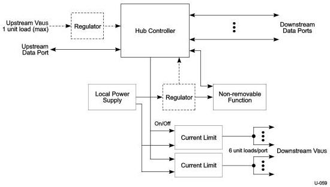

Universal Serial Bus 3.1 Specification, Revision 1.0

### 11.4.1.1 Self-powered Hubs

Self-powered hubs have a local power supply that furnishes power to any non-removable functions and to all downstream facing ports, as shown in Figure 11-1. Power for the Hub Controller, however, may be supplied from the upstream VBUS (a "hybrid" powered hub) or the local power supply. The advantage of supplying the Hub Controller from the upstream supply is that communication from the host is possible even if the device's power supply remains off. This makes it possible to differentiate between a disconnected and an unpowered device. If the hub draws power for its upstream facing port from VBUS, it may not draw more than one unit load.

Figure 11-1. Compound Self-powered Hub

The maximum number of ports that can be supported is limited by the capability of the local VBUS supply.

#### 11.4.1.1.1 Over-current Protection

The host and all self-powered hubs must implement over-current protection for safety reasons, and the hub must have a way to detect the over-current condition and report it to the USB software. Should the aggregate current drawn by a gang of downstream facing ports exceed a preset value, the over-current protection circuit removes or reduces power from all affected downstream facing ports. The over-current condition is reported through the hub to the Host Controller, as described in Section 10.13.5. The preset value cannot exceed 5.0 A and must be sufficiently higher than the maximum allowable port current or time delayed such that transient currents (e.g., during power up or dynamic attach or reconfiguration) do not trip the over-current protector. If an over-current condition occurs on any port, subsequent operation of the USB is not guaranteed, and once the condition is removed, it may be necessary to reinitialize the bus as would be done upon power-up. The over-current limiting mechanism must be resettable without user mechanical intervention.

11-4