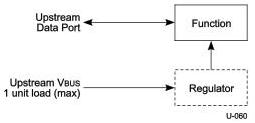
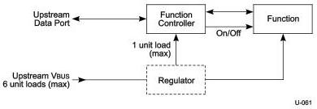

Interoperability and Power Delivery

Polymeric PTCs and solid-state switches are examples of methods that can be used for over-current limiting.

### 11.4.1.2 Low-power Bus-powered Devices

A low-power device is one that draws up to one unit load from the USB cable when operational. Figure 11-2 shows a typical bus-powered, low-power device, such as a mouse. Low-power regulation can be integrated into the device silicon. Low-power devices must be capable of operating with input VBUS voltages as low as 4.00 V, measured at the plug end of the cable.

Figure 11-2. Low-power Bus-powered Function

### 11.4.1.3 High-power Bus-powered Devices

A device is defined as being high-power if, when fully powered, it draws over one but no more than six unit loads from the USB cable. A high-power device requires staged switching of power. It must first come up in a reduced power state of less than one unit load. At bus enumeration time, its total power requirements are obtained and compared against the available power budget. If sufficient power exists, the remainder of the device may be powered on. High-power devices shall be capable of operating with an input voltage as low as 4.00 V. They must also be capable of operating at full power (up to six unit loads) with an input voltage of 4.00 V measured at the device side of the B-series receptacle.

A typical high-power device is shown in Figure 11-3. The device's electronics have been partitioned into two sections. The device controller contains the minimum amount of circuitry necessary to permit enumeration and power budgeting. The remainder of the device resides in the function block.

Figure 11-3. High-power Bus-powered Function

11-5