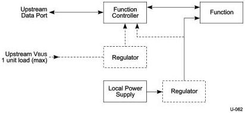

Universal Serial Bus 3.1 Specification, Revision 1.0

### 11.4.1.4 Self-powered Devices

Figure 11-4 shows a typical self-powered device. The device controller is powered either from the upstream bus via a low-power regulator or from the local power supply. The advantage of the former scheme is that it permits detection and enumeration of a self-powered device whose local power supply is turned off. The maximum upstream power that the device controller can draw is one unit load, and the regulator block must implement inrush current limiting. The amount of power that the device block may draw is limited only by the local power supply. Because the local power supply is not required to power any downstream bus ports, it does not need to implement current limiting, soft start, or power switching.

Figure 11-4. Self-powered Function

### 11.4.2 Steady-State Voltage Drop Budget

The steady-state voltage drop budget is derived from the following assumptions:

- The nominal 5 V ± 5% source (host or hub) is 4.75 V to 5.25 V.
- The voltage supplied at the connector of hub or root ports shall be between 4.45 V to 5.25 V.
- The maximum voltage drop (for detachable cables) between the A-series plug and B-series plug on VBUS is 171 mV.
- The maximum current for the calculations is 0.9 A.
- The maximum voltage drop for all cables between upstream and downstream on GND is 171 mV.
- The maximum voltage drop for all mated connectors is 27 mV.
- All hubs and peripheral devices shall be able to provide configuration information with as little as 4.00 V at the device end of their B-series receptacle. Both low and high-power devices need to be operational with this minimum voltage.

Figure 11-5 shows the minimum allowable voltages. Note that under transient conditions, the supply at the device can drop to 3.67 V for a brief moment.

11-6