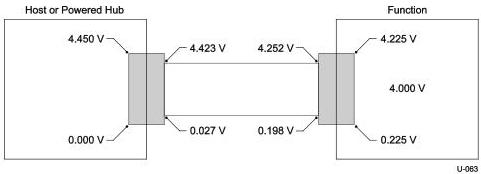
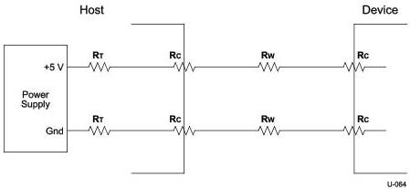

Interoperability and Power Delivery

Figure 11-5. Worst-case Voltage Drop Topology (Steady

State) Note: the following assumptions were used in Figure 11-5:

- 3 meter cable assembly with A-series and B-series plugs
- #22AWG wire used for power and ground (0.019 Ω/foot)
- A-series and B-series plug/receptacle pair have a contact resistance of 30 mΩ
- Wire ~380 mΩ series resistance
- IR Drop at device = (((2 * 30 mΩ) + 190 mΩ) * 900 mA) * 2 or 0.450 V

Figure 11-6. Worst-case Voltage Drop Analysis Using Equivalent Resistance

[tbl-255.md](tbl-255.md)

11-7