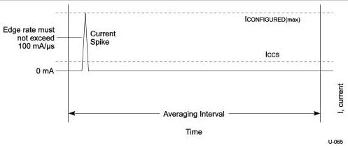

Universal Serial Bus 3.1 Specification, Revision 1.0

### 11.4.3 Power Control During Suspend/Resume

All USB devices may draw up to 2.5 mA during suspend. When configured, bus-powered compound devices may consume a suspend current of up to 12.5 mA. This 12.5 mA budget includes 2.5 mA suspend current for the internal hub plus 2.5 mA suspend current for each port on that internal hub having attached internal functions, up to a maximum of four ports. When computing suspend current, the current from VBUS through the bus pull-up and pull-down resistors must be included.

While in the Suspend state, a device may briefly draw more than the average current. The amplitude of the current spike cannot exceed the device power allocation 150 mA (or 900 mA). A maximum of 1.0 second is allowed for an averaging interval. The average current cannot exceed the average suspend current limit (ICCS, see Table 11-2) during any 1.0-second interval. The profile of the current spike is restricted so the transient response of the power supply (which may be an efficient, low-capacity, trickle power supply) is not overwhelmed. The rising edge of the current spike must be no more than 100 mA/μs. Downstream facing ports must be able to absorb the 900 mA peak current spike and meet the voltage droop requirements defined for inrush current during dynamic attach. Figure 11-7 illustrates a typical example profile for an averaging interval.

Figure 11-7. Typical Suspend Current Averaging Profile

Devices are responsible for handling the bus voltage reduction due to the inductive and resistive effects of the cable. When a hub is in the Suspend state, it must still be able to provide the maximum current per port (six unit loads per port for self-powered hubs). This is necessary to support remote wakeup-capable devices that will power-up while the remainder of the system is still suspended. Such devices, when enabled to do remote wakeup, must drive resume signaling upstream within 10 ms of starting to draw the higher, non-suspend current. Devices not capable of remote wakeup must not draw the higher current when suspended.

When devices wakeup, either by themselves (remote wakeup) or by seeing resume signaling, they must limit the inrush current on VBUS. The device must have sufficient on-board bypass capacitance or a controlled power-on sequence such that the current drawn from the hub does not exceed the maximum current capability of the port at any time while the device is waking up.

11-8