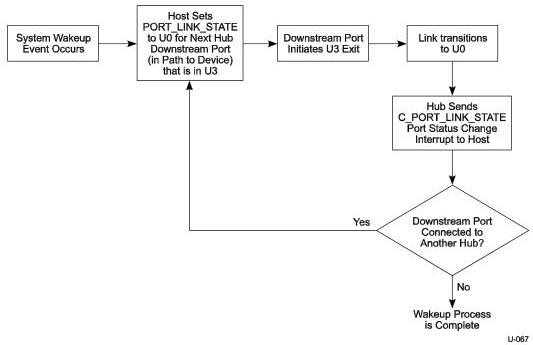

Power Management

### C.1.4.4 Host Initiated Wake from Suspend

Host initiated wake from suspend (U3 → U0) of an individual device, group of devices, or of the entire link hierarchy is accomplished using the same repetitive process, one link at a time.

Figure C-1 illustrates the Host initiated Wake Sequence.

Figure C-1. Flow Diagram for Host Initiated Wakeup

### C.1.4.5 Device Initiated Wake from Suspend

A device initiated transition from suspend (U3 → U0) follows the sequence outlined below:

1. The device transmits LFPS wakeup signaling to its link partner.
2. The LFPS signaling is propagated upstream until it reaches the root hub or a hub that is not in U3. This hub is referred to as the Controlling Hub.
3. The Controlling Hub then automatically reflects LFPS wakeup signaling on the downstream port which had received (from the opposite direction) the wakeup signaling.
4. Each hub in the direct path to the remote wakeup device propagates the wakeup signaling downstream on the hub downstream port that had received wakeup signaling. As the wakeup signaling is propagated downstream, each link completes the LFPS handshake and transitions to U0 (refer to Chapters 6 and 7 for details).
5. After all of the links between the Controlling Hub and the remote wakeup device transition to U0, the function within the remote wakeup device that had originated the remote wakeup sends a Function Wake device notification packet to the host. This in turn causes a software interrupt, and in the service of this interrupt the function suspend state is cleared for that function.

C-11