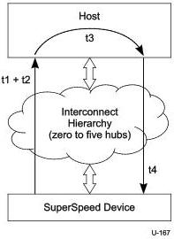

Power Management

Figure C-2. Device Total Intrinsic Latency Tolerance

Devices may calculate their BELT value by subtracting U1SEL or U2SEL (refer to the SET_SEL request in Chapter 9) from their total intrinsic latency tolerance. If the device allows its link to enter U2, then the device calculates its BELT by subtracting U2SEL from its total intrinsic latency tolerance. If the device does not allow its link to enter U2 but does allow its link to enter U1, then the device calculates its BELT by subtracting U1SEL from its total intrinsic latency tolerance.

U1SEL and U2SEL are calculated and programmed by host software. Example calculations for t1 are provided in Section C.2. For LTM purposes t2 and t4 should be calculated by host software as follows:

- For t2, a hub may delay forwarding the ERDY by up to one maximum packet size (approximately 2.1 μs including framing) when there is a transfer in progress. Each additional hub will delay forwarding the ERDY by up to approximately tHubDelay to transfer the packet. The value of t2 is determined as follows:

- If there are zero hubs in the direct path between the device and the host, then t2 is zero
- If there are one or more hubs in the direct path between the device and the host, then t2 is approximately 2.1 μs + tHubDelay * (number of hubs - 1)

- For t4, a hub may delay forwarding a packet by up to approximately tHubDelay. The value of t4 is approximately tHubDelay times the number of hubs in the direct path between the device and the host).

### C.1.5.2 Maximum Exit Latency and PING

The host controller is provided with a Maximum Exit Latency (MEL) value that it uses to schedule a PING relative to a periodic transfer. The Maximum Exit Latency must comprehend worst case round trip delay of sending a PING to a device and receiving the PING_RESPONSE from it.

The Maximum Exit Latency factors in the end to end latencies between host and the device. These would include other latencies associated with the time required to awaken sleeping links, the

C-13