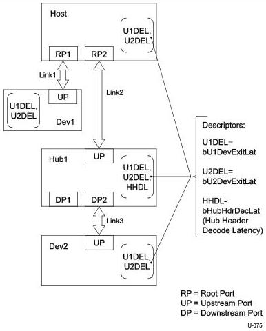

Power Management

## C.2 Calculating U1 and U2 End to End Exit Latencies

This section provides examples of how to calculate the exit latency (i.e., time to transition from a non-U0 state to a U0 state) spanning the end to end path between a device and the host. Examples are given for both device initiated exit and host initiated exit.

Figure C-3 depicts a SuperSpeed hierarchy and calls out the relevant parameters used in the calculations that follow.

Figure C-3. Host to Device Path Exit Latency Calculation Examples

C-15