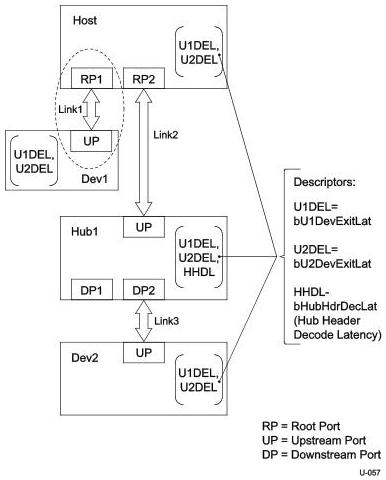

Universal Serial Bus 3.1 Specification, Revision 1.0

### C.2.1 Device Connected Directly to Host

#### C.2.1.1 Host Initiated Transition

In this example, a peripheral device (Dev1) and a host controller root port (RP1) are link partners communicating over a link (Link1).

Figure C-4. Device Connected Directly to a Host

C-16