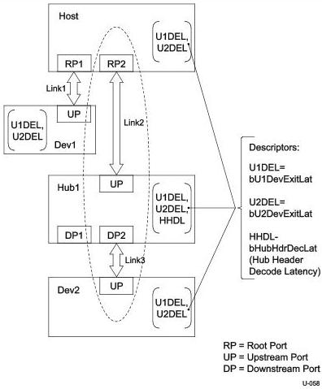

Universal Serial Bus 3.1 Specification, Revision 1.0

### C.2.2 Device Connected Through a Hub

In this example a peripheral device (Dev2) is connected to one of a hub's downstream ports (DP2) via a link (Link3), which in turn is connected to a host controller's root port (RP2) via a link (Link2).

Figure C-5. Device Connected Through a Hub

#### C.2.2.1 Host Initiated Transition

##### U1 → U0 Transition Latency

This example highlights the end to end latency incurred when transitioning both Link2 and Link3 from U1 → U0. For the purposes of this example, it is assumed that all link partners are enabled for U1, and that both Link2 and Link3 are currently in the U1 state.

C-18