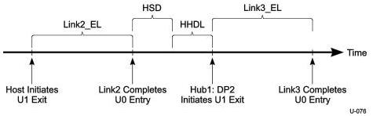

Power Management

Figure C-6 shows the chronological sequence of events. Following the figure is a more detailed description of each stage of the multi-hop link state transition.

Figure C-6. Downstream Host to Device Path Exit Latency with Hub

1. The host is prepared to send a packet to Dev2, however it first needs to bring Link2 out of U1 before it is able to send the packet. The host begins the process by transmitting LFPS on RP2 to Hub1's upstream port (UP) which then starts both link partners transitioning in parallel towards U0. This latency is characterized by the larger of RP2:U1DEL and Hub1:U1DEL
2. Once the Link2 partners are in U0, the host schedules the packet targeting Dev2. After a Host Scheduling Delay (HSD) the packet is then sent over Link2 where it then is routed to Link3. This routing incurs the latency associated with the Hub having to parse the packet header to determine the target downstream port for the packet. This latency is characterized by the hub parameter HHDL.
3. The final hop requires Hub1:DP2 to signal LFPS over Link3 at which point the final component of the end to end latency is executed by the Link3 partners in parallel. This final ingredient to the end to end latency is characterized by the larger of Hub1:U1DEL and Dev2_UP:U1DEL.

The total latency for end to end link transition to U0 can be summarized as:

Max(RP2:U1DEL, Hub1:U1DEL) + HSD + HUB1:HHDL + Max(Hub1:U1DEL, Dev2_UP:U1DEL)

### U2 → U0 Transition Latency

This example highlights the end to end latency incurred when transitioning both Link2 and Link3 from U2 → U0. For the purposes of this example it is assumed that all link partners are enabled for U2 and that both Link2 and Link3 are currently in the U2 state.

1. The host is prepared to send a packet to Dev2, however it first needs to bring Link2 out of U2 before it is able to send the packet. The host begins the process by transmitting LFPS to Hub1:UP which then starts both link partners transitioning in parallel towards U0. This latency is characterized by the larger of RP2:U2DEL and Hub1:U2DEL.
2. Once the Link2 partners are in U0 the host sends its packet targeting Dev2 over Link2 where it then needs to be routed to Link3. This incurs the latency associated with the Hub having to parse the packet header to determine the target downstream port for the packet. This latency is characterized by the hub parameter HHDL.

C-19