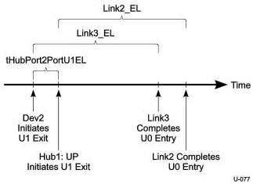

Universal Serial Bus 3.1 Specification, Revision 1.0

3. The final hop requires Hub1:DP2 to signal LFPS over Link3 at which point the final component of the end to end latency is executed by the Link3 partners in parallel. This final ingredient to the end to end latency is characterized by the larger of Hub1:U2DEL and Dev2_UP:U2DEL.

The total exit latency for end to end link transition to U0 can be summarized as:

Max(RP2:U2DEL, Hub1:U2DEL) + HSD + Hub1:HHDL + Max(Hub1:U2DEL, Dev2_UP:U2DEL)

### C.2.2.2 Device Initiated Transition

This section provides some examples for calculating end to end exit latencies for device initiated exit.

### U1 → U0 Transition Latency

This example highlights the end to end latency incurred when transitioning both Link2 and Link3 from U1 → U0. For the purposes of this example it is assumed that all link partners are enabled for U1 and that both Link2 and Link3 are currently in the U1 state.

Figure C-7 depicts the end to end link state transition in chronological order. Following the figure a more detailed description of the sequence is provided.

Figure C-7. Upstream Device to Host Path Exit Latency with Hub

1. Dev2 is prepared to send a packet upstream to the host. However, it first needs to bring Link3 out of U1 and back to U0 before it is able to send the packet. Dev2 begins the process by transmitting LFPS to Hub1:DP2 which then starts both link partners transitioning in parallel towards U0. The Link3 exit latency (Link3_EL) is characterized by the larger of Dev2_UP:U1DEL and Hub1_DP2:U1DEL.
2. After a latency of tHubPort2PortU1EL, the time it takes the hub to determine that one of its downstream ports is awakening, the hub then begins signaling LFPS on Link2 to initiate transition of the Link2 partners (hub's upstream port and host controller root port RP2) to U0.

C-20