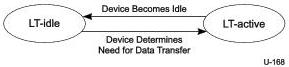

Universal Serial Bus 3.1 Specification, Revision 1.0

In the following subsections, first a description of BELT and its relationship to overall system exit latency is given. This is followed by a description of a device state machine implementation example.

### C.4.1 Device State Machine Implementation Example

This section describes an example of a typical device implementation. It assumes the device implementation supports both U1 and U2 in conjunction with LTM.

In this example, two device Latency Tolerance states (LT-states) are defined:

- LT-idle state: the device is idle and can tolerate a larger latency from the system (this is the default state).
- LT-active state: the device has determined a need to perform data transfers with the host and wants a shorter latency from the system.

A state machine is illustrated in Figure C-8.

Figure C-8. LT State Diagram

The device described by this implementation example is designed to accommodate the worst case value for U1SEL during LT-active, and the worst case value for U2SEL during LT-idle.

The following device design goals are to be met:

- Design for a minimum LTM BELT of 1 ms when in LT-idle
- Design for a minimum LTM BELT of 125 μs when in LT-active

#### C.4.1.1 LTM-Idle State BELT

The device determines its LT-idle state BELT value by subtracting U2SEL from the total latency it can tolerate. To achieve a minimum LT-idle state BELT of 1 ms, the total latency the device must be able to tolerate is 1 ms plus the worst case value for U2SEL, or a total of approximately 3.1 ms (refer to Section C.1.5.1). The worst case U2SEL is based on a worst case device-to-host U2 exit latency of 2.053 ms for t1 (2.047 ms device exit latency plus 1 μs for each of five hubs), plus 0.003 ms for t2, plus 0.001 ms for t4, plus some guard band.

For system implementations where U2SEL is less than its worst case value, the device reports a BELT value larger than 1 ms.

#### C.4.1.2 LTM-Active State BELT

The device determines its LT-active state BELT value by subtracting U1SEL from the total latency it can tolerate. To achieve a minimum LT-active state BELT of 125 μs, the total latency the device must be able to tolerate is 125 μs plus the maximum value for U1SEL, or a total of approximately 145 μs. The worst case U1SEL is based on a worst case device-to-host U1 exit latency of 15 μs for t1 (10 μs device exit latency plus 1 μs for each of five hubs), plus 3.1 μs for t2, plus 1.3 μs for t4,

C-24