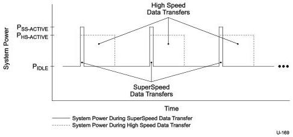

Power Management

Figure C-9 illustrates a sample device that has an average data transfer rate of 20 MBps when actively in use. The figure shows the system power consumption when the device is operating in SuperSpeed mode and also in High Speed mode.

Figure C-9. System Power during SuperSpeed and High Speed Device Data Transfers

When no data transfer is taking place the system power consumption is P_IDLE. P_IDLE is approximated to be the same in both SuperSpeed and High Speed modes. Link power management considerations are ignored for simplicity of illustration.

When a data transfer is taking place, the system power is P_SS-ACTIVE and P_HS-ACTIVE for SuperSpeed and High Speed modes respectively. The difference between P_SS-ACTIVE and P_HS-ACTIVE is due to the physical layer interface power of the device and its link partner (no hubs present).

Data transfers complete roughly ten times faster in SuperSpeed mode than in High Speed mode. This causes the average system power in High Speed mode to be much larger than the average system power in SuperSpeed mode. The difference in average system power may be as high as 50% during a data transfer. This can have a major impact on the battery life of mobile systems.

C-27