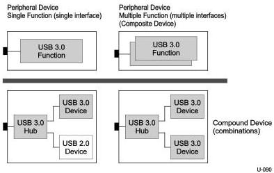
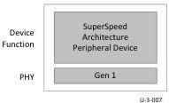
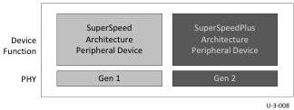

USB 3.1 Architectural Overview

Figure 3-5. Examples of Supported USB 3.1 USB Physical Device Topologies

An Enhanced SuperSpeed portion of a peripheral device may only be assembled into one of the following configurations:

- SuperSpeed Only Peripheral Device. This device implementation is comprised of a Gen 1 only PHY and conforms to the SuperSpeed link, protocol and device specifications; see Figure 3-6.

Figure 3-6. SuperSpeed Only Enhanced SuperSpeed Peripheral Device Configuration

- Enhanced SuperSpeed Device. This is an attachable device that must implement both SuperSpeed and SuperSpeedPlus device architecture and at all Gen X speeds; see Figure 3-7.

Figure 3-7. Enhanced SuperSpeed Device Configuration

For additional information about USB 3.1 Hubs, see section 3.2.6.2.

3-13