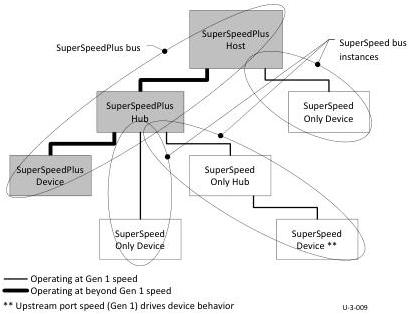

USB 3.1 Architectural Overview

Figure 3-8 illustrates a SuperSpeedPlus hub with an upstream facing port running in beyond Gen 1 speed, supporting downstream devices operating at both Gen 1 speed and beyond Gen 1 speeds.

In contrast to the SuperSpeed hub, which is characterized as a repeater/forwarder hub architecture, the SuperSpeedPlus hub is characterized as a store-and-forward hub because it can receive one or more entire DPs before transmitting up or downstream. The store-and-forward architecture of a SuperSpeedPlus hub allows a host to schedule multiple endpoint bursts, across multiple endpoints, for both in-bound and out-bound flows, as long as they bursts are to SuperSpeedPlus endpoints. The SuperSpeedPlus host is also able to use the same SuperSpeedPlus scheduling rules across SuperSpeed endpoints on different downstream SuperSpeed bus instances. The SuperSpeedPlus host must use SuperSpeed only bus scheduling rules for all SuperSpeed endpoints on the same SuperSpeed bus instance.

Figure 3-8. Multiple SuperSpeed Bus Instances in an Enhanced SuperSpeed System

A SuperSpeedPlus hub consists of three logical components: a SuperSpeedPlus hub controller, a SuperSpeedPlus upstream controller and a SuperSpeedPlus downstream controller (one for each downstream facing port).

A SuperSpeedPlus hub is required to implement USB PTM (Precision Time Management).

SuperSpeedPlus hubs actively participate in the (end-to-end) protocol in several ways, including:

- Routes and preserves ordering (within an endpoint flow) of out-bound packets (TPs, DPs) from the upstream port to specific downstream ports
- Routes in-bound packets and preserves ordering (within an endpoint flow) to the upstream port, via:

- Providing fair-service for simultaneously active, in-bound, asynchronous transfer type endpoint data flows, independent of device operating speed or location within the topology.
- Providing strict-priority for simultaneously active, in-bound, periodic transfer type endpoint data flows, independent of device operating speed or location within the topology.

3-15