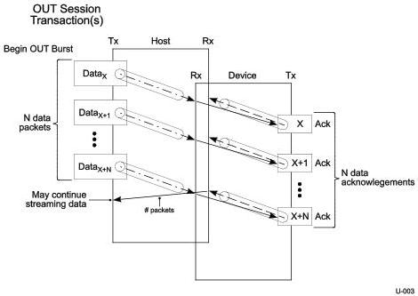

USB 3.1 Enhanced SuperSpeed Data Flow Model

The Enhanced SuperSpeed OUT transaction protocol is illustrated in Figure 4-2. An OUT transfer on the Enhanced SuperSpeed bus consists of one, or more, OUT transactions consisting of one, or more, packets and completes when any one of the following conditions occurs:

- All the data for the transfer is successfully transmitted.
- The host sends a packet that is less than the endpoints maximum packet size.
- The endpoint responds with an error.

Figure 4-2. Enhanced SuperSpeed OUT Transaction Protocol

### 4.4.4 Power Management and Performance

The use of inactivity timers and device-driven link power management provides the ability for very aggressive power management. When the host sends a packet to a device behind a hub with a port whose link is in a non-active state, the packet will not be able to traverse the link until it returns to the active state. In the case of an IN transaction on a SuperSpeed bus instance, the host will not be able to start another IN transaction on that SuperSpeed bus instance until the current one completes. The effect of this behavior could have a significant impact on overall performance.

To balance power management with good performance, the concept of a deferral (to both INs and OUTs) is used. When a host initiates a transaction that encounters a link in a non-active state, a deferred response is sent by the hub to tell the host that this particular path is in a reduced power managed state and that the host should go on to schedule other transactions. In addition, the hub sends a deferred request to the device to notify it that a transaction was attempted. This mechanism informs the host of added latency due to power management and allows the host to mitigate performance impacts that result from the link power management.

4-7